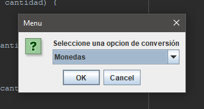
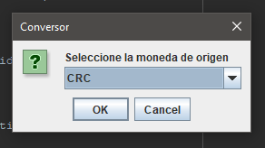
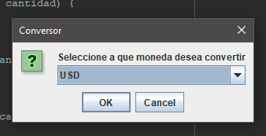
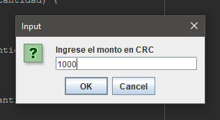
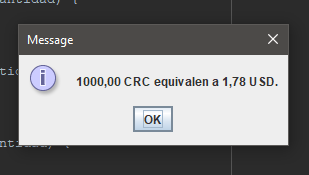
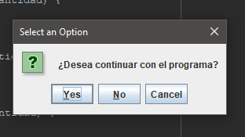

# Conversor-Challenge-ONE-Java

***Conversor de divisas utilizando el lenguaje Java.***

## Funcionalidades:

### El convertidor de moneda puede:

    - Convertir de la moneda de tu país a Dólar
    - Convertir de la moneda de tu país a Euros
    - Convertir de la moneda de tu país a Libras Esterlinas
    - Convertir de la moneda de tu país a Yen Japonés
    - Convertir de la moneda de tu país a Won sul-coreano

### Tambien que también debe ser posible convertir inversamente, es decir:

    - Convertir de Dólar a la moneda de tu país
    - Convertir de Euros a la moneda de tu país
    - Convertir de Libras Esterlinas a la moneda de tu país
    - Convertir de Yen Japonés a la moneda de tu país
    - Convertir de Won sul-coreano a la moneda de tu país

## Extra

***El convertidor de longitudes***

## Imagenes

## ***Insignia por concluir el challenge***

